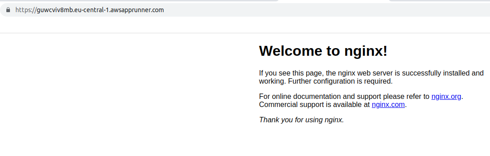

### What is AWS App Runner?

- It is a fully managed service for deploying containerized web apps and APIs.

### Test

- Let's deploy public nginx docker image -> https://gallery.ecr.aws/nginx/nginx

1. Configure Source and Deployment

 - Select "Container Registry" and "Amazon ECR Public"
 - Copy image URI from https://gallery.ecr.aws/nginx/nginx ( i.e public.ecr.aws/nginx/nginx:stable-perl) and put it to "Container Image URI"
 - Press "Next"

 
 

2. Configure Service
  
  - Give service name
  - Give CPU/Memory
  - Give port (for our test nginx's port is 80)
  - Press "Next"

  

3. Review & Create
  
- Press "Create and Deploy"

4. Access the NGINX App

- After some minutes, the Service will be ready and you can access via the address given on "Default Domain"

### Resources

1. https://aws.amazon.com/apprunner/

2. [AWS App Runner - Digital Cloud Training](https://www.youtube.com/watch?v=ycdo9UyNs98)